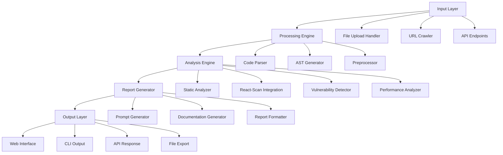

# Design Document

## Overview

The AI Code Vulnerability Scanner is a comprehensive system that analyzes AI-generated frontend code for security vulnerabilities and performance issues, then generates tailored LLM prompts and documentation to guide improvements. The system supports both file uploads and URL crawling, integrates with static analysis tools like react-scan, and provides detailed reporting with actionable insights.

The architecture follows a modular design with clear separation between scanning, analysis, prompt generation, and reporting components. The system can operate as both a standalone CLI tool and a web service with API endpoints.

## Architecture

### High-Level Architecture



### System Components

#### 1. Input Layer
- **File Upload Handler**: Processes uploaded code files (JS, TS, JSX, TSX, HTML, CSS)
- **URL Crawler**: Extracts frontend code from websites using headless browser automation
- **API Endpoints**: RESTful API for programmatic access and CI/CD integration

#### 2. Processing Engine
- **Code Parser**: Normalizes different input formats into a common structure
- **AST Generator**: Creates Abstract Syntax Trees using TypeScript compiler API or Babel
- **Preprocessor**: Cleans and prepares code for analysis, handles bundled/minified code

#### 3. Analysis Engine
- **Static Analyzer**: Core vulnerability detection using configurable rule sets
- **React-Scan Integration**: Specialized React component analysis
- **Vulnerability Detector**: OWASP-based security issue identification
- **Performance Analyzer**: Identifies optimization opportunities and anti-patterns

#### 4. Report Generator
- **Prompt Generator**: Creates context-aware LLM prompts for each identified issue
- **Documentation Generator**: Produces or enhances code documentation
- **Report Formatter**: Outputs results in multiple formats (JSON, PDF, Markdown, HTML)

## Components and Interfaces

### Core Interfaces

```typescript
interface ScanRequest {
  source: 'file' | 'url';
  input: string | File[];
  options: ScanOptions;
  userId?: string;
  subscriptionTier: 'free' | 'paid';
}

interface ScanOptions {
  includePerformance: boolean;
  includeSecurity: boolean;
  generatePrompts: boolean;
  generateDocs: boolean;
  targetLLM?: 'gpt-4' | 'claude' | 'generic';
  severity: 'all' | 'high' | 'critical';
}

interface VulnerabilityFinding {
  id: string;
  type: 'security' | 'performance';
  severity: 'critical' | 'high' | 'medium' | 'low';
  title: string;
  description: string;
  location: CodeLocation;
  recommendation: string;
  owaspCategory?: string;
  cweId?: string;
}

interface CodeLocation {
  file: string;
  line: number;
  column: number;
  snippet: string;
}

interface LLMPrompt {
  findingId: string;
  targetModel: string;
  prompt: string;
  context: string;
  expectedOutcome: string;
}

interface ScanResult {
  scanId: string;
  timestamp: Date;
  source: ScanRequest['source'];
  findings: VulnerabilityFinding[];
  prompts: LLMPrompt[];
  documentation: DocumentationSuggestion[];
  summary: ScanSummary;
}
```

### Component Architecture

#### Scanner Service
```typescript
class ScannerService {
  async scanCode(request: ScanRequest): Promise<ScanResult>;
  async scanUrl(url: string, options: ScanOptions): Promise<ScanResult>;
  async scanFiles(files: File[], options: ScanOptions): Promise<ScanResult>;
}
```

#### Analysis Engine
```typescript
class AnalysisEngine {
  private staticAnalyzer: StaticAnalyzer;
  private reactScanner: ReactScanner;
  private performanceAnalyzer: PerformanceAnalyzer;

  async analyze(ast: AST, options: ScanOptions): Promise<VulnerabilityFinding[]>;
}
```

#### Prompt Generator
```typescript
class PromptGenerator {
  generatePrompts(findings: VulnerabilityFinding[], targetLLM: string): LLMPrompt[];
  private createSecurityPrompt(finding: VulnerabilityFinding): string;
  private createPerformancePrompt(finding: VulnerabilityFinding): string;
}
```

## Data Models

### Database Schema

```sql
-- Users and subscriptions
CREATE TABLE users (
  id UUID PRIMARY KEY,
  email VARCHAR(255) UNIQUE NOT NULL,
  subscription_tier VARCHAR(20) DEFAULT 'free',
  scan_count_monthly INTEGER DEFAULT 0,
  created_at TIMESTAMP DEFAULT NOW()
);

-- Scan results
CREATE TABLE scans (
  id UUID PRIMARY KEY,
  user_id UUID REFERENCES users(id),
  source_type VARCHAR(10) NOT NULL, -- 'file' or 'url'
  source_identifier TEXT NOT NULL,
  status VARCHAR(20) DEFAULT 'pending',
  findings_count INTEGER DEFAULT 0,
  created_at TIMESTAMP DEFAULT NOW(),
  completed_at TIMESTAMP
);

-- Individual findings
CREATE TABLE findings (
  id UUID PRIMARY KEY,
  scan_id UUID REFERENCES scans(id),
  type VARCHAR(20) NOT NULL, -- 'security' or 'performance'
  severity VARCHAR(10) NOT NULL,
  title VARCHAR(255) NOT NULL,
  description TEXT,
  file_path VARCHAR(500),
  line_number INTEGER,
  column_number INTEGER,
  code_snippet TEXT,
  recommendation TEXT,
  owasp_category VARCHAR(50),
  cwe_id VARCHAR(20)
);

-- Generated prompts
CREATE TABLE llm_prompts (
  id UUID PRIMARY KEY,
  finding_id UUID REFERENCES findings(id),
  target_model VARCHAR(50),
  prompt_text TEXT NOT NULL,
  context_info TEXT,
  expected_outcome TEXT
);
```

### Configuration Models

```typescript
interface AnalysisRules {
  security: SecurityRule[];
  performance: PerformanceRule[];
  react: ReactRule[];
}

interface SecurityRule {
  id: string;
  name: string;
  description: string;
  severity: 'critical' | 'high' | 'medium' | 'low';
  pattern: string | RegExp;
  owaspCategory: string;
  cweId?: string;
}

interface PerformanceRule {
  id: string;
  name: string;
  description: string;
  impact: 'high' | 'medium' | 'low';
  pattern: string | RegExp;
  recommendation: string;
}
```

## Error Handling

### Error Categories

1. **Input Validation Errors**
   - Invalid file formats
   - Malformed URLs
   - Missing required parameters

2. **Processing Errors**
   - Parse failures
   - AST generation errors
   - Analysis timeouts

3. **External Service Errors**
   - URL crawling failures
   - React-scan integration issues
   - LLM API failures

4. **System Errors**
   - Database connection issues
   - File system errors
   - Memory/resource constraints

### Error Handling Strategy

```typescript
class ErrorHandler {
  handleScanError(error: Error, context: ScanContext): ScanResult {
    switch (error.type) {
      case 'PARSE_ERROR':
        return this.createPartialResult(context, error);
      case 'TIMEOUT_ERROR':
        return this.retryWithReducedScope(context);
      case 'EXTERNAL_SERVICE_ERROR':
        return this.fallbackAnalysis(context);
      default:
        throw new SystemError('Unhandled scan error', error);
    }
  }
}
```

### Graceful Degradation

- If react-scan fails, fall back to generic static analysis
- If URL crawling fails, provide manual upload option
- If LLM prompt generation fails, provide generic templates
- If documentation generation fails, skip but continue with vulnerability reporting

## Testing Strategy

### Unit Testing
- **Analysis Engine**: Test individual vulnerability detection rules
- **Prompt Generator**: Verify prompt quality and format for different LLMs
- **Code Parser**: Test AST generation for various code patterns
- **Report Generator**: Validate output formats and data integrity

### Integration Testing
- **End-to-End Scanning**: Test complete workflow from input to output
- **External Service Integration**: Mock and test react-scan, URL crawling
- **Database Operations**: Test scan result persistence and retrieval
- **API Endpoints**: Test RESTful API functionality

### Performance Testing
- **Large File Handling**: Test with complex, large codebases
- **Concurrent Scans**: Verify system handles multiple simultaneous scans
- **Memory Usage**: Monitor memory consumption during analysis
- **Response Times**: Ensure acceptable scan completion times

### Security Testing
- **Input Sanitization**: Test against malicious code inputs
- **URL Validation**: Prevent SSRF and other URL-based attacks
- **Rate Limiting**: Verify subscription tier enforcement
- **Data Privacy**: Ensure scan results are properly isolated

### Test Data Strategy

```typescript
interface TestScenario {
  name: string;
  input: TestInput;
  expectedFindings: ExpectedFinding[];
  expectedPrompts: number;
}

const testScenarios: TestScenario[] = [
  {
    name: 'React XSS Vulnerability',
    input: { type: 'code', content: reactXSSExample },
    expectedFindings: [
      { type: 'security', severity: 'high', owaspCategory: 'A03:2021' }
    ],
    expectedPrompts: 1
  },
  // Additional test scenarios...
];
```

### Continuous Integration

- Automated testing on pull requests
- Performance regression detection
- Security vulnerability scanning of the scanner itself
- Integration tests with real-world code samples
- Prompt quality validation using LLM evaluation metrics
